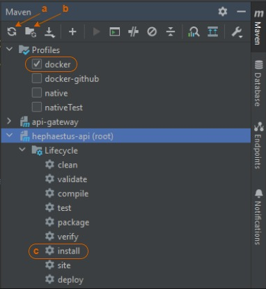

<div align="center">
   
</div>

<div align="center">

   [Requirements](#requirements) | 
   [Usage](#usage) | 
   [Important URLs](#important-urls) |
   [Possible problems](#possible-problems)

</div>

## What Does This Project Do?
**Hephaestus** is a personal project designed to help users make informed decisions about household appliances. The application evaluates the condition and damage of the appliance and provides a recommendation on what action to take.

The project consists of two components:
- Frontend built with Angular 
- Backend developed using Java ( **you are here 📍** )

**Backend is hosted on Azure with a burst configuration, which means it may temporarily shut down when idle. If the service doesn't respond immediately, try refreshing a few times to wake it up.**

You can access the following services:

- **[OpenAPI Docs](https://api-gateaway.kindmeadow-812476e6.northeurope.azurecontainerapps.io/webjars/swagger-ui/index.html)**  
  Explore and test all the API endpoints in the backend.

- **[Zipkin on Azure](https://zipkin.kindmeadow-812476e6.northeurope.azurecontainerapps.io)**  
  A **Zipkin server** is available to monitor and trace requests across the application.

## Technologies Used
* **Java 17** - The backend is written in Java 17, chosen for its long-term support and modern improvements.
* **Spring Boot 3** - Provides a framework for rapid setup and configuration, offering embedded servers, dependency injection, and a robust plugin ecosystem.
* **Spring Cloud Gateway** - Manages API requests and routes traffic, serving as the backend's main entry point.
* **Spring Data JPA** - Simplifies database operations with repository interfaces.
* **PostgreSQL** - A relational database system known for its advanced features, performance, and strong community support.
* **Flyway** - Manages database migrations, maintaining schema consistency across environments.
* **QueryDSL** - A framework for building type-safe readable queries.
* **OpenFeign** - Simplifies REST API calls with declarative HTTP clients.
* **Micrometer Tracing** - Provides observability through the collection of metrics and tracing, integrating with OpenTelemetry APIs for distributed tracing.
* **Zipkin** - Works with Micrometer Tracing to export trace data, enabling monitoring and analysis of request flows within the application.
* **Junit 5** - Primary testing framework used for writing and executing unit tests.
* **Mockito 3** - Facilitates unit testing by creating mock objects, allowing for isolated testing of components without dependencies.
* **Jib** - Simplifies Docker image creation for Java apps by building images directly from the source, eliminating the need for Dockerfiles.
* **Docker Compose** - Manages multi-container applications, allowing the backend to run in isolated, reproducible environments with its dependencies.
* **JasperReports** - Facilitates the creation of detailed, dynamic PDF reports with customizable layouts and data visualization.
* **OpenAPI** - Standardized API documentation, improving endpoint understanding and interaction.

## Local Deployment with Docker
### Requirements
To run the backend locally using Docker, make sure you have the following installed:
* IntelliJ IDEA (or any other IDE)
* Java 17
* Docker
* Docker Compose

### Usage
1. Clone the repository:
```bash
git clone https://github.com/cristeaibogdan/hephaestus-api.git
```
2. Start Docker
3. Set Maven Profile to `docker` 

   a. Click  `Reload All Maven Projects` 

   b. Click `Generate Sources and Update Folders For All Projects`

   c. Run `install` for `hephaestus-api`
<p align="center">
   
</p>

4. Docker images will be created in your local daemon (takes some time to build all of them...)
5. Open a terminal in the root folder (`hephaestus-api`) and start all containers:
```bash
docker-compose up -d
```
6. All backend services should be up and running.

### Important URLs
- [Pgadmin](http://localhost:5050) - `localhost:5050`
  1. Use `postgres` to login
  2. Register new server
  3. On the Connection tab use `postgres` for Host name/address, username and password

- [Zipkin](http://localhost:9411) - `localhost:9411`
- [Swagger](http://localhost:8083/webjars/swagger-ui/index.html) - `localhost:8083/webjars/swagger-ui/index.html`

## Possible problems
The microservice `washing-machine` may fail to recognize `QWashingMachine` generated by Querydsl.

**Solution:**

   1. Run Maven `clean` and `install` for `hephaestus-api`
   2. Navigate to `washing-machine-domain` module directory.
   3. Go to `target` directory
   4. Open `generated-sources` directory
   5. Right click `annotations`, select `Mark Directory as` and choose `Generated Sources Root`

***
